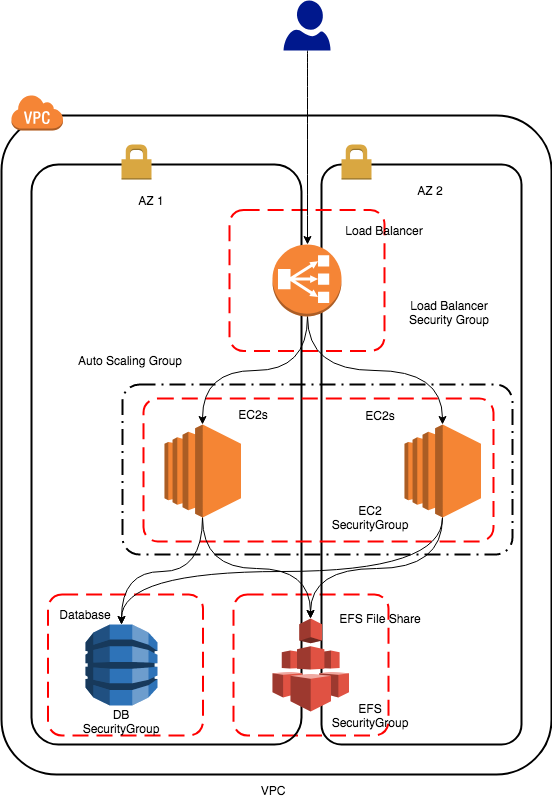

# Word Press

CloudGuild WordPress related items.



## Creating a Stack

```
aws cloudformation create-stack --stack-name cloudguild-wordpress-01 --template-body file://wordpress.yml --parameters ParameterKey=DBPassword,UsePreviousValue=true --capabilities CAPABILITY_IAM
```

## Updating the Stack

```
aws cloudformation update-stack --stack-name cloudguild-wordpress-01 --template-body file://wordpress.yml --parameters ParameterKey=DBPassword,UsePreviousValue=true --capabilities CAPABILITY_IAM
```
